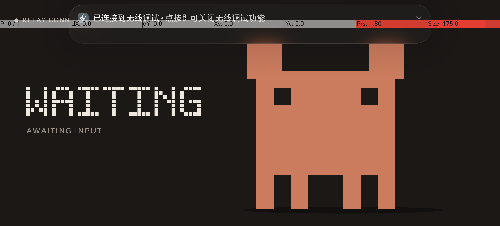
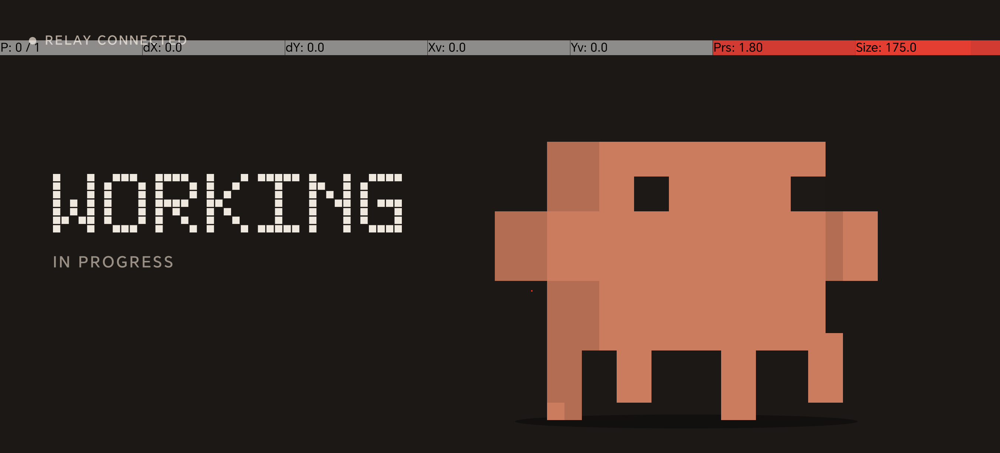

# Wireless integration check — 2026-10-05

- Relay endpoint: `http://192.168.1.9:8788` (`ws://192.168.1.9:8788/ws/collector`); `healthz=ok`, auth mode is `paired`, storage is SQLite, and the Collector is connected. Relay PID `83056` and Collector PID `83063` are kept alive for this login session by temporary `launchctl submit` jobs `com.claude-phone-monitor.relay-temporary` and `com.claude-phone-monitor.collector-temporary`; no auto-start LaunchAgent was added. The existing paired installation was reused: `8f2af74e-daf6-43a9-98df-1669d08ad736`. No pairing or credential rotation was performed.
- Relay readiness at the check: `readyz=ready`, `active_connections=1`, `collector_connections=1`, and `android_connections=0`. The gateway-specific counters count SQLite connection records, which may include disconnected historical records; `active_connections` counts live connections in the current Relay process.
- Hook path: invoked the installed monitor-owned `SessionStart` adapter path with only `hook_event_name=SessionStart` and `session_id=wireless-smoke-20261005`. The synthetic metadata traveled through the local Hook adapter socket, Collector, and paired Relay. The immediate snapshot advanced from sequence `1060` to `1061` with `session_started`, while the computer stayed `online` and Claude state `idle`. The latest safe snapshot is also `online/idle`, at sequence `1065` with `session_ended` as its last activity. No prompt, command, path, tool input, or tool output was sent.
- Mac checks: Relay typecheck passed and 12/12 tests passed; Collector typecheck passed and 15/15 tests passed.
- Android checks: 24 offline unit tests passed and a debug APK was built. APK SHA-256: `69f37c438ff6b1d3681f94383c8386fc2c95c07744d5af4e1f22db97694f02eb` (`apps/android/build/outputs/apk/debug/android-debug.apk`).
- Wireless ADB pairing completed through the phone's pairing endpoint `192.168.1.5:33113`; this is the pair port only. The separate ADB TLS connection has not been established; the latest timed mDNS lookup returned no `_adb-tls-connect._tcp` service, but discovery was incomplete. Relay currently has no Android connection. APK installation and on-device animation acceptance remain pending.

## Automatic discovery follow-up

- Reused the existing local ADB server on `127.0.0.1:5038` with Platform Tools 37.0.1. `adb mdns check` reported the discovery backend available; `adb mdns services` and `adb devices -l` returned no services or devices.
- macOS Bonjour browses for `_adb-tls-connect._tcp` and `_adb-tls-pairing._tcp` ran for 8 seconds each and returned no services. ADB's local help supports `pair`, `connect`, and mDNS discovery; `ADB_MDNS` was unset. At that stage, no endpoint was available to connect, so no pairing, device command, or install was attempted.
- Wireless pairing later succeeded on pair port `192.168.1.5:33113`. A timed lookup by the returned pairing GUID remained at `STARTING` and was stopped after 8 seconds. The TLS connection endpoint and pairing PIN were not recorded.
- A limited direct `adb connect` attempt to candidate `192.168.1.5:35859` failed with `transport offline`, and that connection was disconnected. The candidate is unconfirmed; the available scan was incomplete, so this does not establish that no ADB connect port exists. The connection address and port shown on the phone's Wireless debugging page are still pending.
- The user then supplied the phone's current connection endpoint, `192.168.1.5:37115`. Both official `adb connect` and a Python direct TCP attempt received `Connection refused` (`errno 61`, about 6 ms). This confirms the attempts were refused but does not establish why the phone refused them; packet capture was unavailable because BPF access required an unprovided sudo password. Existing pairing was retained; ADB was not restarted, and no re-pairing or key changes were made.

## 2026-10-06 live-device progress (partial)

- After pausing the VPN and toggling Wireless Debugging off and back on, ADB connected to `192.168.1.5:34289`. Because both actions preceded the connection, the result cannot be attributed to the VPN change alone. The device was verified as `AMP-AN00`, API 36, with its ADB serial matching the connected phone; the full serial is omitted. With the phone awake in the foreground, ADB still listed it after a separate exec call.
- `adb install -r` installed version `0.2.1` (versionCode `3`) over the existing app. The APK SHA-256 matched the previously recorded build (`69f37c438ff6b1d3681f94383c8386fc2c95c07744d5af4e1f22db97694f02eb`), and app data was preserved.
- The existing `real_pairing.xml` had no QR payload, so the app's first Relay binding used a newly created one-time QR for the existing installation. The pairing reached `claimed`; the existing Mac Collector environment and token were left unchanged. Relay was `ready` with `active_connections=2` during the check.
- Version `0.2.1` remained installed with the existing app data. After a force-stop and relaunch, the claimed Relay binding and paired credentials were still present; Relay reported `active_connections=2`. The phone showed both `WAITING` and `RELAY CONNECTED` after relaunch:

  

- A real `UserPromptSubmit` event traversed the installed safety-pinned session Hook, Collector, and Relay as sequence `1844`, then appeared on the phone as `WORK / IN PROGRESS`. The screenshot is linked below. It used a fixed test session and contained no prompt or command content.

  

- `PermissionRequest` sequence `1845` was stored as `waiting`, and the helper matched the same test session. The screenshot capture took 2.638 seconds and showed the pet without a visible `WAITING` label, so the live waiting display is not counted as passed. `Stop` sequence `1846`, `PostToolUse` sequence `1847`, and `StopFailure` sequence `1850` were also matched and stored for the same test session.
- StopFailure overlay screenshots could not be captured because ADB went offline. The five-second FINISH and ten-second ERROR overlay checks, plus manual reconnect acceptance, remain pending. This is still a partial live-device result, not full acceptance.
