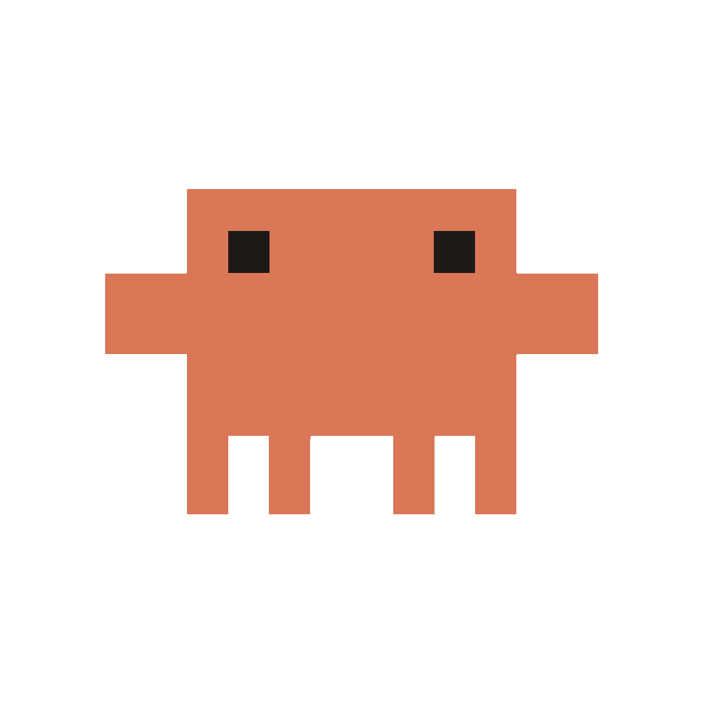
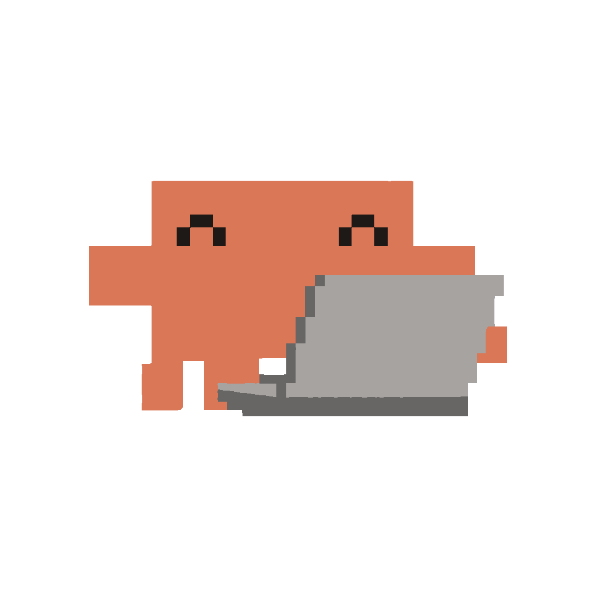
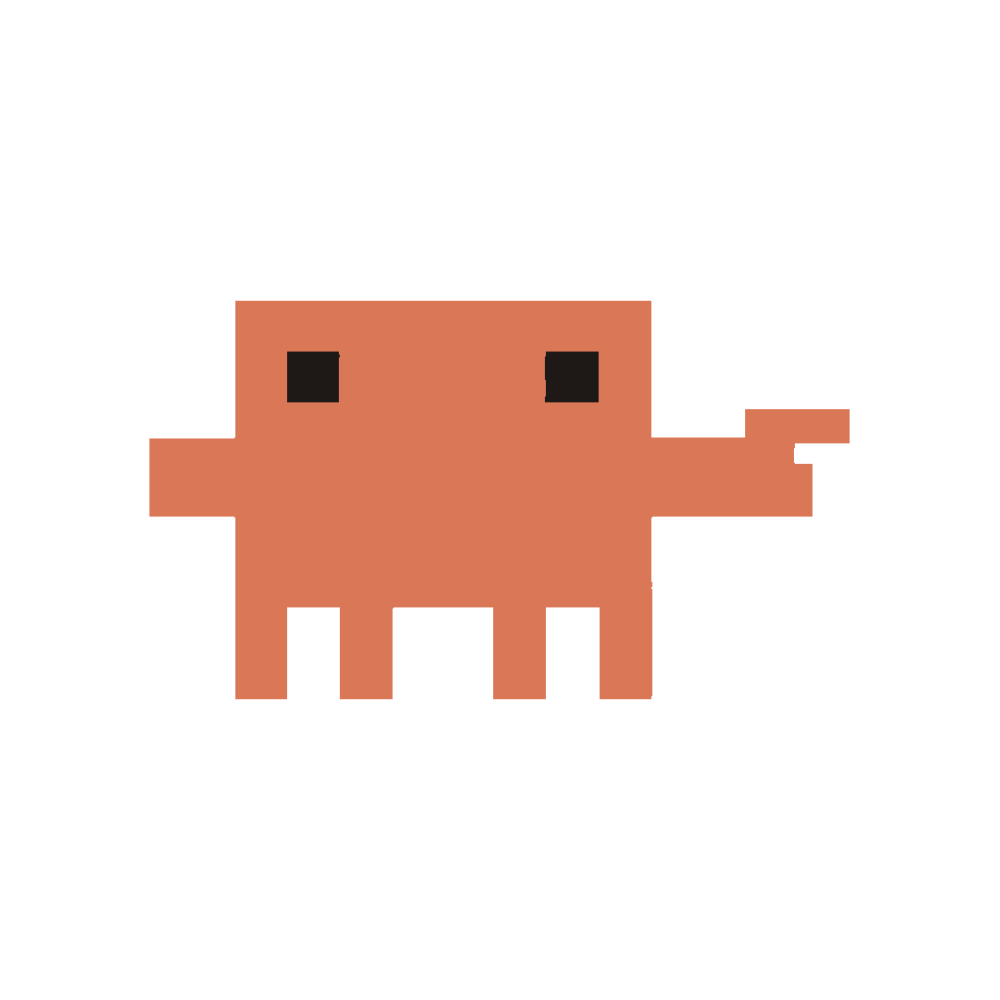
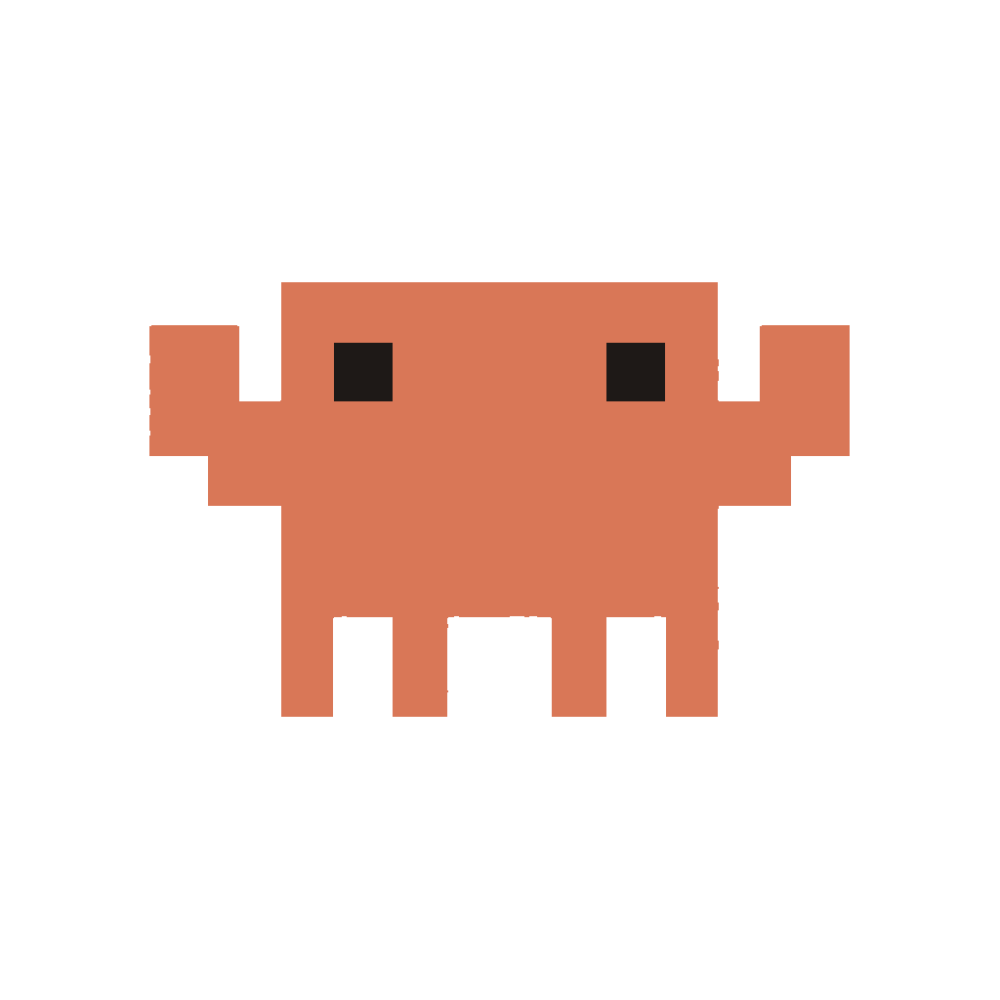
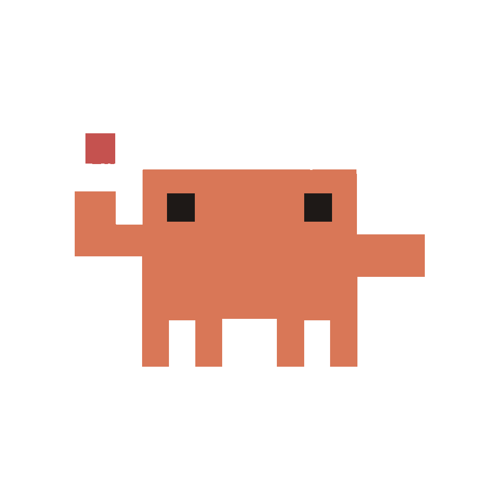
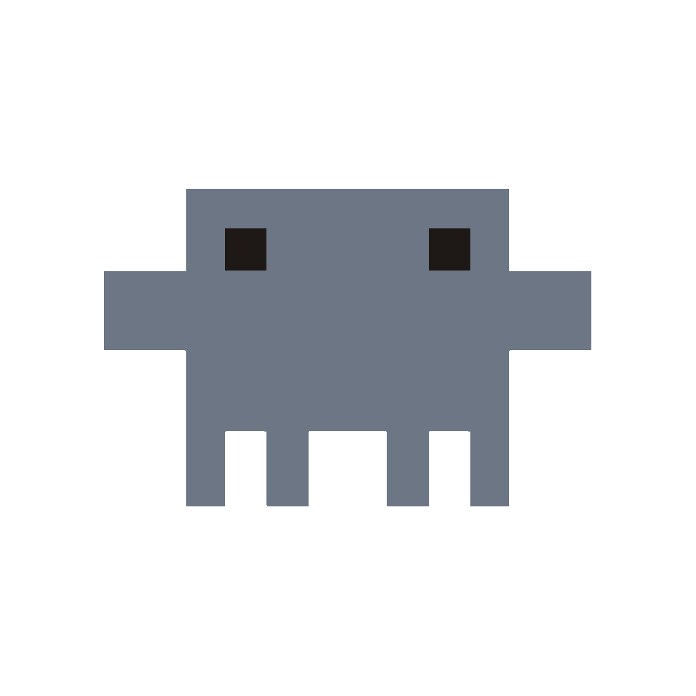
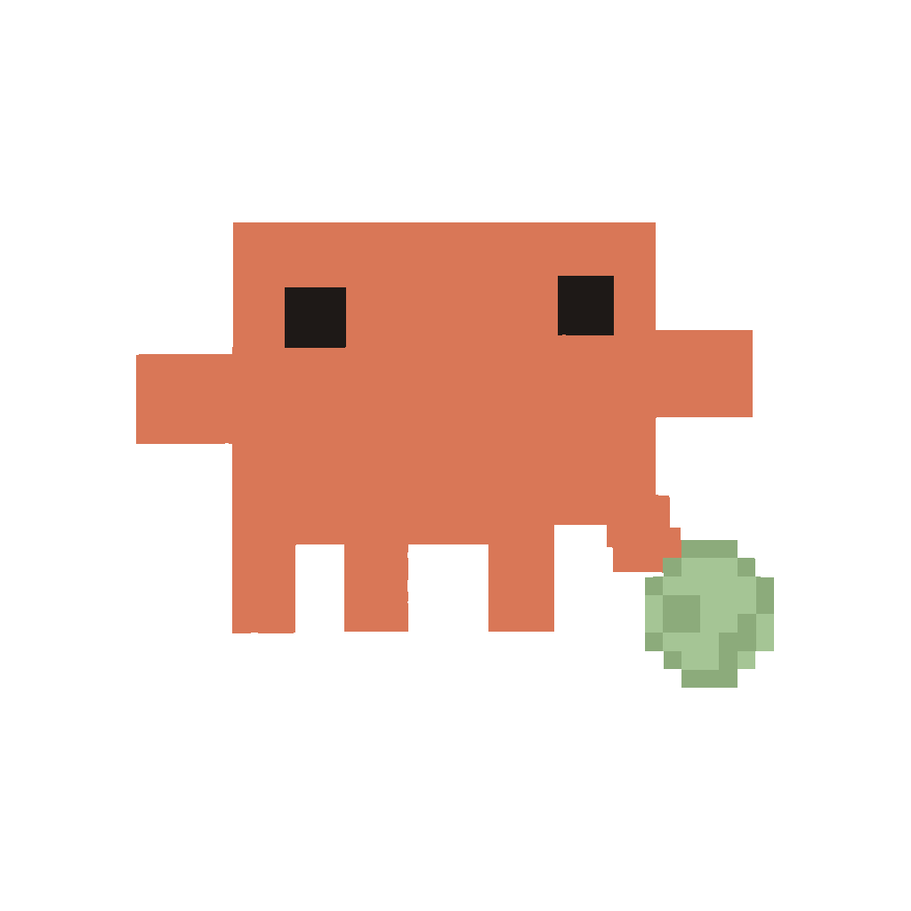

# Issue #8：已接入动画的关键姿态预览

以下显示 7 张动画源关键姿态及独立完整球，均为 **1024×1024 透明 RGBA**。素材已完成用户授权的技术清理并通过素材视觉审核；原姿态 PNG 原样保留。WORKING 双手在运行时替换为旧 4×4 代码手样式，Usage 球替换为独立道具，所以源姿态不代表本轮运行时完整构图。本页展示静态素材；本轮 19 项实机回归与最终受控帧检查已通过，动态证据为 [实机受控采样预览](../issue-8-device-validation.md)，不是墙钟录屏。

原姿态的 8 次 AI 输出与清理过程见 [生成账本](generated-assets.jsonl)，新球的独立生成与处理记录见 [道具账本](generated-props.jsonl)；原始 [确认计划](pending-prompts.jsonl) 未修改。当前动作和页面规则见 [方案文档](../issue-8-pet-actions.md)。本页直接引用文件，没有合成或修改图片。

**IDLE — idle-rest-clean**：STATUS、STATE_CHANGE；运行时原地呼吸、眨眼。

**WORKING — working-typing-clean（源姿态）**：STATUS、STATE_CHANGE；运行时清除图中的原手橙块，恢复旧 4×4 深描边、橙掌心双手，以 320 ms 旧序列敲击、1,920 ms 循环，电脑和身体固定。

**WAITING — waiting-point-clean**：STATUS、STATE_CHANGE；运行时指向手端小幅往返。

**FINISH — finish-cheer-clean**：STATUS、STATE_CHANGE；运行时原地轻抬双臂庆祝。

**ERROR — error-alert-clean**：STATUS、STATE_CHANGE；运行时暖红警示块明暗脉冲，角色原地。

**OFFLINE — offline-rest-clean**：STATUS、STATE_CHANGE；运行时静止，保持深色眼睛 `#1E1917`。

**USAGE — usage-ball-clean（源姿态）**：仅 USAGE；角色和腿取自此图，运行时球替换为独立完整球。

**独立完整球 — usage-soccer-ball-clean**：运行时使用 `clawd/props/usage-soccer-ball.png`，替换源姿态中的旧球，随连续走近、触球、滚球追逐和换向动作滚动旋转。

7 张 v1 原图因尺寸与纹理偏差保留为 `pending`、不采用为交付；IDLE v2 的失败工具纠正为 `rejected`。它们的文件、实际提交 prompt 和生成记录全部保留。各 v1 的 `processed_image_path` 指向本页文件，`processing.review_status` 为 `accepted`。
